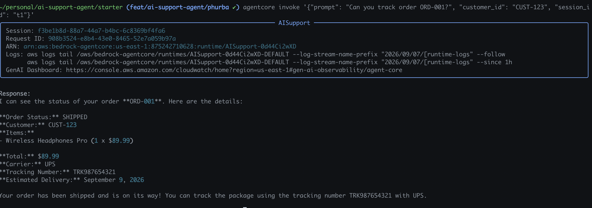
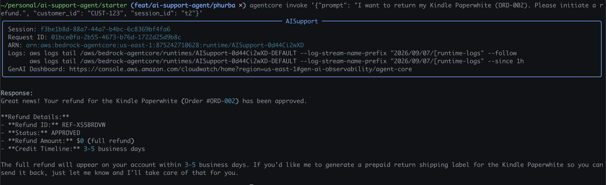
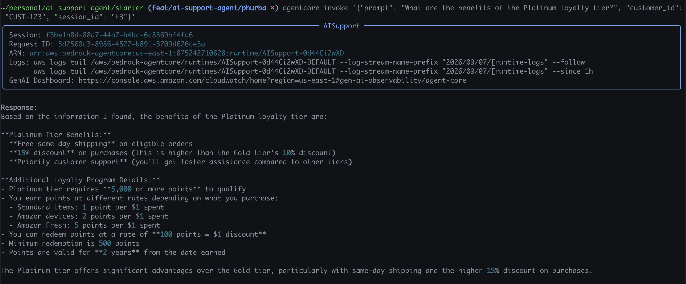
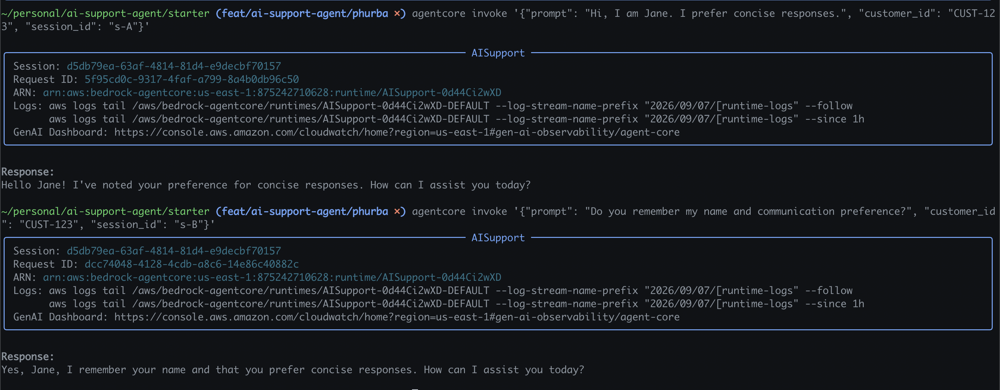
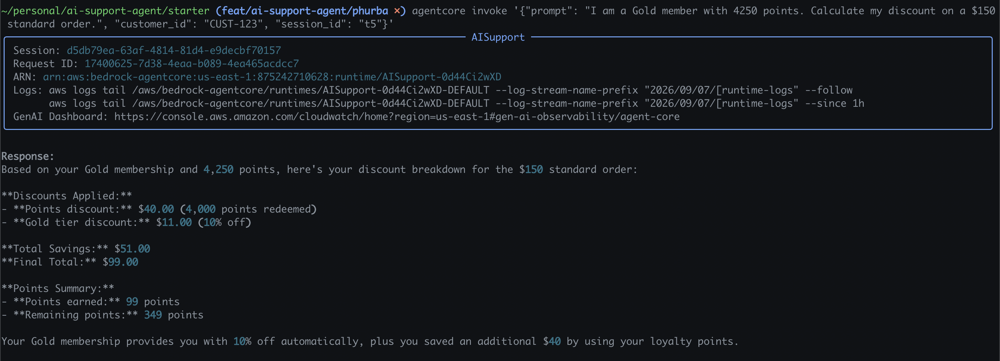
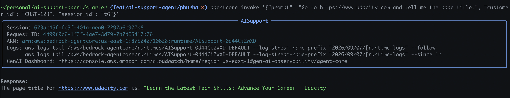

# Code Quality & Reflection

## Tool Descriptions
- **Memory Context Save**: Persists the user's name, preferences, and interaction history after each turn to allow for long-term recall across different sessions.
- **Memory Context Retrieve**: Queries specific memory namespaces (e.g., customer facts, preferences) before generating a response, ensuring the agent uses past context.
- **Knowledge Base Retrieve**: Connects to the Amazon Bedrock Knowledge Base (backed by OpenSearch and S3) to perform Retrieval-Augmented Generation (RAG) for accurate product and policy answers.
- **Browser Tools**: Navigates live websites to fetch real-time information, such as page titles or external content, directly within the agent's workflow.
- **Code Interpreter**: A secure sandbox environment to dynamically generate and execute Python code for precise tasks like calculating complex loyalty discounts.
- **get_orders (Order Tracker)**: An MCP-integrated Lambda tool via AgentCore Gateway that queries and returns shipping status, tracking numbers, and delivery estimates.
- **refund (Refund Processor)**: A Lambda tool connected via the Gateway to securely initiate and process customer product refund requests.

## Implementation Choice
Because the overall structure of the agent was already fully templated within the provided codebase, there isn't much to say regarding high-level architectural decisions. My implementation choices primarily revolved around efficiently following the scaffolding to wire the tools together without over-engineering the solution.

## Concrete Challenges
Writing the actual agent code wasn't particularly difficult, mostly because the provided `# TODO` comments gave away way too many hints. In the future, I would strongly prefer having basic documentation links to specific features rather than highly detailed, step-by-step TODO instructions, as it would provide a much better learning experience. 

Instead, the main issue I faced was entirely on the AWS infrastructure side—specifically, making sure the permissions and IAM roles were correctly configured. The IAM role setup was the main headache of this project. I successfully resolved these access issues by actively watching the cloud execution logs, identifying the exact missing privileges during runtime, and progressively adding the necessary permissions to the respective execution roles.

## Production Considerations
If I were to deploy this agent into a true production environment, my primary consideration would be adding robust monitoring and observability. I would want to integrate detailed traces and spans across the entire request lifecycle. Doing so would allow us to precisely pinpoint latency bottlenecks (such as a slow API Gateway or Lambda cold start) and granularly track the cost associated with each specific LLM generation and tool invocation.

---

## Test Scenarios

### Test 1 — Order Tracking

### Test 2 — Refund Processing

### Test 3 — Knowledge Base (RAG)

### Test 4 — Memory (Long-Term)

### Test 5 — Loyalty Discount Calculation

### Test 6 — Browser Tool

